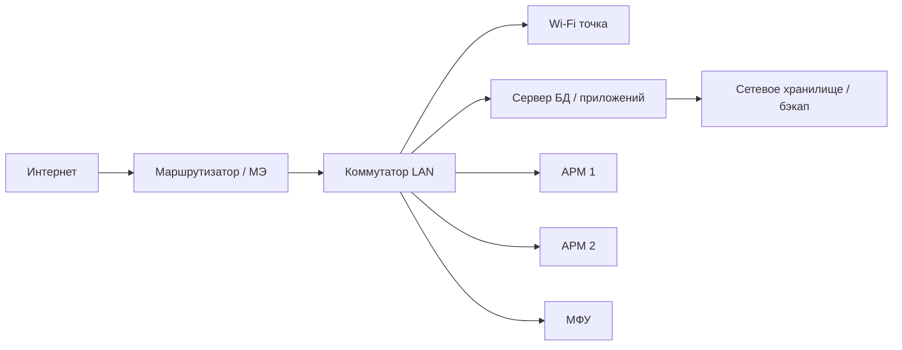

# Этап 1. Инфокоммуникационные системы, ОС и виртуализация

## 1. Что такое инфокоммуникационная система

**Инфокоммуникационная система (ИКС)** — комплекс программных и аппаратных средств, обеспечивающий хранение, передачу, обработку и представление информации. К ИКС относятся:

- автоматизированные рабочие места (АРМ) пользователей;
- серверы (СУБД, файловые, веб-, прокси-, почтовые, контроллер домена);
- сетевое оборудование (коммутаторы, маршрутизаторы, точки доступа Wi-Fi);
- периферия (МФУ, сканеры, POS-терминалы, считыватели штрих-кодов);
- виртуальные ресурсы (виртуальные машины, контейнеры, виртуальные сети);
- средства защиты информации (МЭ, антивирусы, СЗИ от НСД).

Оператор технической поддержки в составе ВД 2 отвечает за **установку, настройку, проверку работоспособности и текущий контроль** этих компонентов.

---

## 2. Состав типовой ИКС небольшого офиса

| Уровень | Что входит | Типовое ПО |
|---------|------------|------------|
| Аппаратный | ПК, серверы, СХД, сетевое оборудование | BIOS/UEFI, прошивки |
| Системный | Операционные системы | Windows 10/11/Server, Astra Linux, ALT Linux, Ubuntu Server |
| Сетевой | Стек TCP/IP, DNS, DHCP | `ip`, `netplan`, `Get-NetIPConfiguration` |
| Промежуточный (middleware) | СУБД, веб-серверы, очереди | PostgreSQL, MySQL, MS SQL Express, IIS, nginx |
| Прикладной | Учётные системы, CRM, СЭД | 1С, iiko, Битрикс24, Moodle |
| Защита | МЭ, антивирус, СЗИ от НСД | Брандмауэр Windows, `ufw`, KасперскийED, Secret Net Studio |

---

## 3. Операционные системы и их роль

### 3.1. Windows

- Серверные версии (Windows Server) предоставляют роли: **AD DS**, **DNS**, **DHCP**, **File Server**, **IIS**, **Hyper-V**.
- Клиентские (Windows 10/11) — основная ОС АРМ.
- Управление через `services.msc`, `gpedit.msc`, `lusrmgr.msc`, PowerShell.

### 3.2. Linux

- Основные дистрибутивы для ИКС в РФ: **Astra Linux**, **ALT Linux**, **РЕД ОС**, **Ubuntu Server**, **Debian**, **CentOS Stream**.
- Управление через `systemd` (`systemctl`), `ip`, `ufw`/`iptables`/`nftables`, `apt`/`dnf`.
- Файлы конфигурации в `/etc/`, журналы в `/var/log/` и `journalctl`.

### 3.3. Команды, которые должен знать оператор

| Задача | Windows | Linux |
|--------|---------|-------|
| Сведения о системе | `systeminfo`, `winver` | `uname -a`, `hostnamectl` |
| Список процессов | `tasklist`, `Get-Process` | `ps -ef`, `top`, `htop` |
| Управление службой | `Start-Service`/`Stop-Service` | `systemctl start/stop/status` |
| IP-конфигурация | `ipconfig`, `Get-NetIPAddress` | `ip a`, `ip route` |
| Журнал событий | `Get-WinEvent`, `eventvwr.msc` | `journalctl -xe`, `/var/log/syslog` |
| Установка пакета | `winget install`, `choco install` | `apt install`, `dnf install` |

---

## 4. Виртуализация

**Виртуализация** позволяет на одном физическом сервере размещать несколько изолированных виртуальных машин (ВМ) или контейнеров. В составе ИКС виртуализация решает задачи изоляции сервисов, экономии оборудования, ускорения развёртывания и резервного копирования.

| Тип | Где работает | Примеры |
|-----|--------------|---------|
| Гипервизор тип-1 (bare-metal) | На «голом железе» | VMware ESXi, Proxmox VE, Hyper-V Server |
| Гипервизор тип-2 (хостовый) | Поверх ОС | VMware Workstation, VirtualBox, Hyper-V в Windows 10/11 Pro |
| Контейнеризация | Поверх ядра ОС | Docker, Podman, LXC/LXD |

### Виртуальная сеть

- **Виртуальный коммутатор** в гипервизоре связывает ВМ между собой и с внешним миром.
- Режимы: **Bridged** (ВМ в общей LAN), **NAT** (ВМ в изолированной сети с трансляцией), **Internal/Host-Only** (изолированная сеть).
- В Hyper-V — `New-VMSwitch`; в VirtualBox — Network Manager; в KVM/Proxmox — Linux Bridge / Open vSwitch.

В рамках практики стенд разворачивается **в изолированной среде**: либо отдельная ВМ, либо отдельный физический ПК — это обязательное условие.

---

## 5. Понятие «правильная установка ПО»

Правильность установки ПО — это **проверяемый набор условий**, а не только то, что мастер установки прошёл до конца.

| № | Условие | Как проверить |
|:--:|---------|----------------|
| 1 | Установленная версия совпадает с заявленной | `psql --version`, `mysqld --version`, «О программе» в Windows |
| 2 | Все зависимости установлены | в Linux — `ldd`, `apt list --installed`; в Windows — журнал установщика, наличие «Visual C++ Redistributable» |
| 3 | Служба запущена и в состоянии «running» | `systemctl status postgresql`, `Get-Service` |
| 4 | Открыт ожидаемый сетевой порт | `ss -tnlp`, `netstat -an` |
| 5 | Разрешения на каталоги корректные | `ls -l`, `icacls` |
| 6 | Журнал не содержит критических ошибок | `journalctl -u <unit>`, `eventvwr.msc` |
| 7 | Конфигурация задокументирована | конфиг-файл сохранён в репозитории/папке отчёта |

Этот же чек-лист применяется при проверке после настройки сетевого ПО и базовой конфигурации сетевых устройств (ПК 2.2).

---

## 6. Базовые параметры конфигурации (ПК 2.3)

К базовым параметрам, которые задаёт оператор, относятся:

- **Учёт конфигураций**: имена хостов, пути установки, порты, переменные окружения, версии, параметры запуска служб.
- **Производительность**: параметры памяти СУБД (`shared_buffers`, `innodb_buffer_pool_size`), `ulimit`, размер файла подкачки, приоритеты процессов.
- **Защита от НСД**: пароль администратора, политика паролей, ограничение входа по IP/сети, ACL на каталоги, отключение ненужных учётных записей и служб.

### 6.1. Статическая конфигурация ОС

Параметры записываются в файлы и применяются при старте:

- Linux: `/etc/sysctl.conf`, `/etc/security/limits.conf`, `/etc/ssh/sshd_config`, `/etc/netplan/*.yaml`.
- Windows: групповые политики (`gpedit.msc`), реестр, файл `unattend.xml`.

### 6.2. Динамическая конфигурация ОС

Параметры применяются «на лету» без перезагрузки:

- Linux: `sysctl -w net.ipv4.tcp_keepalive_time=120`, `iptables -A INPUT ...`, `ip route add ...`.
- Windows: `Set-NetFirewallRule`, `New-NetIPAddress`, `Set-Service`, `wmic`.

---

## 7. Документирование инфраструктуры

Оператор обязан вести **учёт конфигураций**: для каждого устройства / сервиса должна быть записана его конфигурация. В рамках практики это решается простыми артефактами:

- инвентаризационная таблица (ОС, версия, IP, MAC, ПО, владелец);
- конфиг-файлы, выгруженные в каталог отчёта;
- скриншоты результата установки и проверки;
- журнал изменений (что, когда, зачем поменяли).

В реальной работе для этого используются CMDB-системы (например, GLPI), Ansible-инвентори, Wiki-порталы и системы тикетов.

---

## 8. Связь теории с этапами практики

| Раздел теории | Где применяется в практике |
|---------------|----------------------------|
| Состав ИКС | проектирование стенда варианта |
| ОС Windows/Linux | этап 1 практики (развёртывание стенда) |
| Виртуализация | этап 1 практики (изолированная среда), этап 3 (мониторинг VM) |
| Правильная установка ПО | этап 1 практики (проверка СУБД), этап 2 практики (сеть) |
| Базовые параметры | этап 2 практики (НСД), этап 3 практики (мониторинг) |
| Учёт конфигураций | этап 4 практики (отчёт) |
