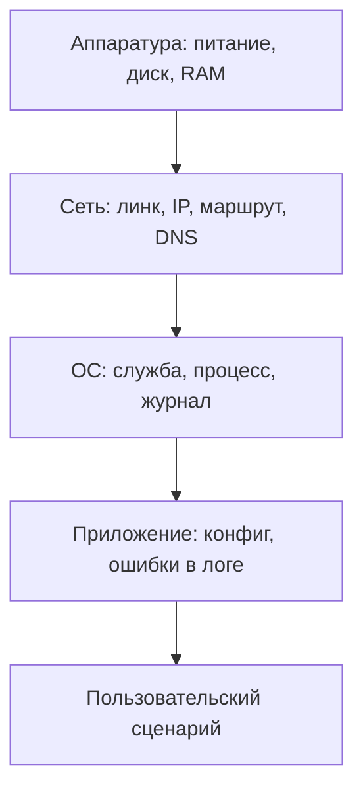

# Этап 3. Диагностика, мониторинг и проверка работоспособности

## 1. Диагностика как процесс

**Диагностика** — последовательная проверка слоёв ИКС от низа к верху для локализации причины сбоя:



Стандартное правило: **сначала проверяем, что сломалось ниже, потом то, что выше**. Не имеет смысла переустанавливать СУБД, если на хосте недоступна сеть.

---

## 2. Журнал событий ОС

### 2.1. Linux — `journalctl`

```bash
journalctl -p err -b              # ошибки текущей загрузки
journalctl -u postgresql -e       # последние строки журнала службы
journalctl --since "1 hour ago"
journalctl --since "2026-04-30 09:00" --until "2026-04-30 12:00"
```

Также используются:

- `/var/log/syslog`, `/var/log/messages`;
- `/var/log/auth.log` (вход в систему);
- `dmesg` — события ядра (диск, USB, RAID).

### 2.2. Windows — Журнал событий

```powershell
Get-WinEvent -LogName System    -MaxEvents 50 | Where-Object Level -le 3
Get-WinEvent -LogName Application -MaxEvents 50
Get-WinEvent -FilterHashtable @{LogName='System'; Level=1,2; StartTime=(Get-Date).AddHours(-48)}
```

GUI: `eventvwr.msc` → Журналы Windows → Система / Приложение / Безопасность.

В отчёте фиксируются как минимум 3 ошибки уровня «Критическая»/«Ошибка» за последние 48 часов: имя события, источник, описание, скриншот или экспорт `.evtx`.

---

## 3. Автозагрузка

| ОС | Где смотреть | Что проверять |
|----|--------------|----------------|
| Linux | `systemctl list-unit-files --state=enabled`, `/etc/cron.d/`, `/etc/systemd/system/` | подозрительные unit-файлы, скрипты, `cron`-задания |
| Windows | `taskmgr` → Автозагрузка, `msconfig`, `autoruns` (Sysinternals) | элементы, не относящиеся к ОС/защитному ПО |

Из 3+ элементов автозагрузки, не связанных с системой/защитой, нужно проанализировать необходимость каждого: что это, когда установлено, должно ли запускаться.

---

## 4. Проверка безопасности

### 4.1. Антивирус и сканирование

| Инструмент | Платформа | Команда |
|------------|-----------|---------|
| Защитник Windows | Windows | `Start-MpScan -ScanType QuickScan` |
| Dr.Web CureIt | Windows | GUI |
| ClamAV | Linux | `sudo freshclam && sudo clamscan -r --infected /home` |
| AVZ / RkHunter | Windows / Linux | сканирование руткитов |

Результаты складываются в `SecurityScan_XX/` (отчёт + скриншоты). Найденные угрозы классифицируются: **вирус**, **потенциально нежелательная программа**, **уязвимость конфигурации**.

### 4.2. Уязвимости конфигурации

| Категория | Как проверить (Linux) | Как проверить (Windows) |
|-----------|------------------------|--------------------------|
| Обновления | `apt list --upgradable` | `Get-WindowsUpdate` (PSWindowsUpdate) |
| Открытые порты | `ss -tnlp`, `nmap localhost` | `Get-NetTCPConnection -State Listen` |
| Слабые пароли | `pam_passwdqc`, `cracklib-check` | `secedit /export /cfg pol.cfg` |
| Права на критичные файлы | `find / -perm -4000 2>/dev/null` (SUID) | `icacls C:\Windows\System32` |

---

## 5. Мониторинг производительности

### 5.1. Встроенные средства

| Метрика | Linux | Windows |
|---------|-------|---------|
| Загрузка CPU | `top`, `htop`, `mpstat` | Диспетчер задач, `Get-Counter '\Processor(_Total)\% Processor Time'` |
| Загрузка RAM | `free -h`, `vmstat 1` | `Get-Counter '\Memory\Available MBytes'` |
| Диск | `iostat -x 1`, `iotop` | `resmon`, `Get-Counter '\PhysicalDisk(_Total)\% Disk Time'` |
| Сеть | `iftop`, `nload`, `ss -s` | `Get-Counter '\Network Interface(*)\Bytes Total/sec'` |
| Процессы | `ps aux --sort=-%cpu` | `Get-Process | Sort-Object CPU -Descending` |
| Снимок системы | `inxi -Fxz`, `lshw -short` | `dxdiag`, `systeminfo` |

### 5.2. Что фиксировать в отчёте

В рамках задания студент фиксирует:

1. 2–3 процесса, которые потребляют наибольшее количество ресурсов;
2. фоновую активность (сеть, диск);
3. таблицу проблем: компонент → проблема/ошибка → причина → рекомендация → риск.

### 5.3. Внешний мониторинг (вариативная часть)

| Стек | Из чего | Когда использовать |
|------|---------|--------------------|
| Prometheus + node_exporter + Grafana | сбор метрик с хостов, дашборд | хочется графики и тренды |
| Zabbix | агент + сервер + веб | централизованный мониторинг множества хостов |
| Netdata | один хост, web-UI «из коробки» | быстрый старт |
| Munin | RRD-графики | минимализм |

В учебной папке `student_infocomm_samples/monitoring/` лежит готовый `prometheus.yml`, `node_exporter.service` и bash-скрипт сбора метрик.

---

## 6. Базовые параметры для слежения за производительностью (ПК 2.3)

### 6.1. Ограничения ОС

```bash
# Linux
ulimit -n            # открытых файлов
cat /proc/sys/fs/file-max
sysctl net.core.somaxconn
```

### 6.2. Параметры PostgreSQL

| Параметр | Что задаёт | Ориентир |
|----------|------------|----------|
| `shared_buffers` | размер буфера в RAM | 25% RAM (но не более 8 ГБ) |
| `work_mem` | память на сортировку/хеш на сессию | 16–64 МБ |
| `maintenance_work_mem` | для VACUUM, CREATE INDEX | 64–512 МБ |
| `max_connections` | предел подключений | по числу клиентов + резерв |
| `effective_cache_size` | подсказка планировщику | 50–75% RAM |
| `log_min_duration_statement` | логировать долгие запросы | 1000 (мс) |

### 6.3. Параметры MySQL

| Параметр | Что задаёт |
|----------|------------|
| `innodb_buffer_pool_size` | основной кэш InnoDB (50–70% RAM) |
| `max_connections` | предел подключений |
| `slow_query_log` + `long_query_time` | журнал медленных запросов |
| `innodb_log_file_size` | размер redo-лога |

---

## 7. Отслеживание производительности ВМ и виртуальных ресурсов (ПК 2.4)

| Объект мониторинга | Откуда снимать |
|--------------------|----------------|
| ВМ в Hyper-V | `Get-VM`, `Get-Counter '\Hyper-V Hypervisor Logical Processor(_Total)\% Total Run Time'` |
| ВМ в VMware | `esxtop`, vCenter Performance |
| ВМ в KVM/Proxmox | `virt-top`, графики Proxmox |
| Контейнеры Docker | `docker stats`, `cAdvisor` |
| Виртуальная сеть | `tcpdump`, `iftop`, метрики коммутатора |

Отслеживание = регулярное снятие метрик + сохранение результатов + реакция на пороговые значения.

---

## 8. Проверка защищённости от НСД (часть ПК 2.4)

| Что проверить | Команда / инструмент |
|---------------|----------------------|
| Открытые порты «в мир» | `nmap -p- <ip>` снаружи |
| Логирование входов | `lastb`, `last`, события 4625/4624 в Windows |
| Разрешённые учётные записи | `cat /etc/passwd`, `Get-LocalUser` |
| Привилегии sudo / Administrators | `getent group sudo`, `Get-LocalGroupMember Administrators` |
| Политика паролей | `chage -l <user>`, `secedit /export` |
| Шифрование диска | `lsblk -o NAME,TYPE,FSTYPE`, `manage-bde` |
| Активные удалённые сессии | `who`, `qwinsta` |

Результат проверки фиксируется в отчёте таблицей: что проверяли → результат → есть ли отклонение → рекомендация.

---

## 9. Связь теории с практикой

| Раздел теории | Где применяется |
|---------------|------------------|
| Журнал событий | этап 3 практики (анализ логов) |
| Автозагрузка | этап 3 практики |
| Проверка безопасности | этапы 2 и 3 практики |
| Мониторинг производительности | этап 3 практики |
| Базовые параметры СУБД | этап 1 и 3 практики |
| Отслеживание ВМ | этап 3 практики (вариативная часть) |
| Проверка защищённости | этапы 2 и 3 практики |
